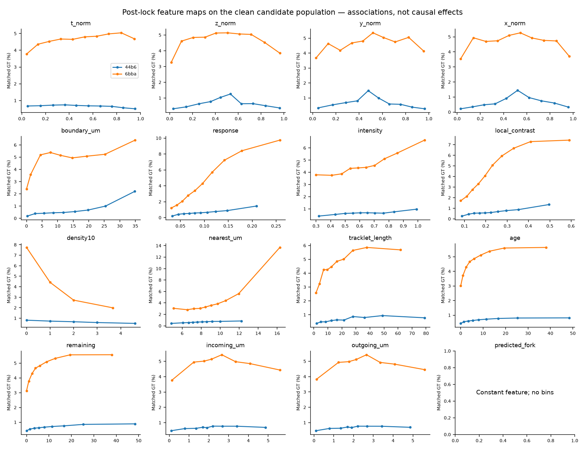
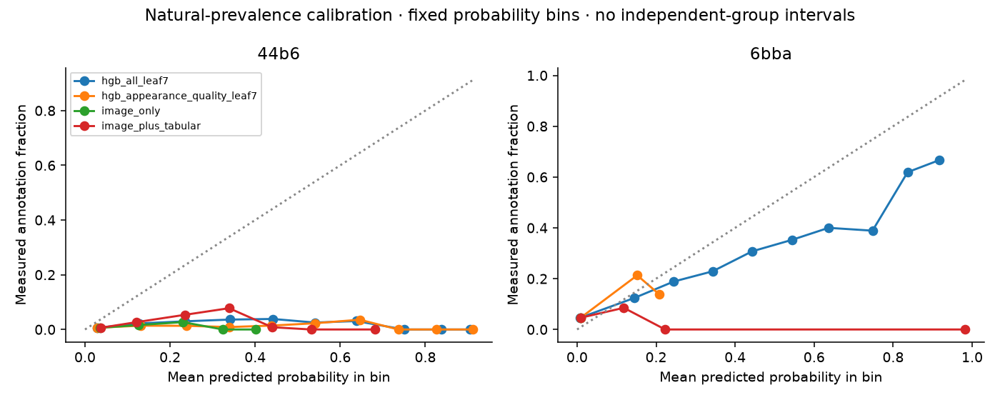
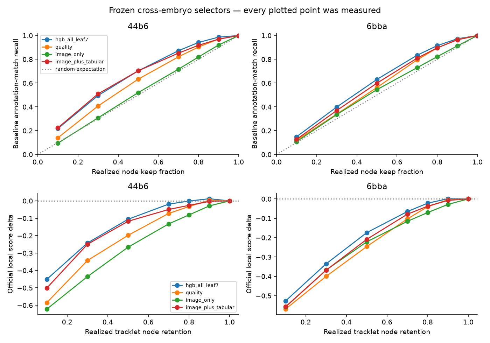

> Portable publication of the completed 2026-09-08 local experiment. Aggregate numbers are unchanged. Links to large or individual-level evidence lead to the local artifact inventory. The source report and manifest hashes are in [bundle_manifest.json](bundle_manifest.json). See [baseline comparison](README.md) and [FOCUS-3D findings](../../handover/annotation-selection-v1/FOCUS3D.md).

# Annotation-selection study: measured local results

Status: **promising_but_uncertain**. Generated 2026-09-08T21:39:13.827253+00:00.

## Executive answer

- **H1, observable membership:** primary AUROC is 0.680–0.696, with AP 1.95–2.19 times natural candidate prevalence. At the primary budget, pooled baseline annotation-match recall is 96.58% and phi/MCC is 0.0343. These are sparse-match targets, not adjudicated true-cell or annotator-selection probabilities.
- **H2, official local score:** pooled score changes from 0.674116 to 0.676907 (+0.002791) at 90.02% realized node retention. The gain relative to ordinary confidence filtering at exactly matched per-video node counts is +0.005636. Direction-specific results remain visible below.
- **H3, source of the change:** count adjustment contributes +0.007121, graph changes -0.004331, and divisions +0.000000. The alpha=0 pooled delta is -0.004323. These contributions use the full measured aggregator. Sources: [retention.csv](retention.csv), [classifier_metrics.csv](classifier_metrics.csv), [matched_budget_summary.csv](matched_budget_summary.csv).

The exact-budget comparison demonstrates an advantage over raw DoG response confidence on these candidates. It does not isolate annotator preference: appearance-only learned selectors also predict sparse membership, and unmatched candidates mix real unannotated cells with detection, localization and duplicate errors. The missing independent cell-quality/census labels leave annotation-specific selection among real cells unresolved.

Transferring the frozen primary rule to Harmonic Fusion changes its pooled diagnostic score from 0.911774 to 0.873322 (-0.038452). This primary transfer harms the stronger tracker. The public lane is contaminated by checkpoint training/selection on the supplied embryos, so it is an operational diagnostic and cannot establish clean unseen-embryo transfer. Source: [public_retention.csv](public_retention.csv).

The complete clean study evaluates **199 training clips in both embryo directions**, using image-only classical candidates and source-embryo annotation membership targets. Both directions' models and all 199 prediction files were frozen and reproduced byte-for-byte with annotation reads blocked before official outer evaluation. The primary rule was fixed before outer outcomes: boosted trees with 7 leaves, all allowed feature groups, and coherent tracklet selection at requested keep 0.9.

| embryo | n | realized_keep | annotation_recall | phi | baseline_score | score | delta |
| --- | --- | --- | --- | --- | --- | --- | --- |
| 44b6 | 71 | 0.9001 | 0.9774 | 0.0210 | 0.7031 | 0.7153 | 0.0123 |
| 6bba | 128 | 0.9004 | 0.9637 | 0.0466 | 0.6689 | 0.6700 | 0.0011 |
| pooled | 199 | 0.9002 | 0.9658 | 0.0343 | 0.6741 | 0.6769 | 0.0028 |


These are local scores from the pinned official implementation, not hidden-test or leaderboard gains. Inner tuning was unavailable: released crop/time origins are absent, and image fingerprints demonstrate overlaps. One conservative overlap supergroup per embryo prevents claiming independent clip-level validation or useful bootstrap confidence intervals. The protocol's fixed-setting fallback was therefore used; this is **not a source-selected optimum**.

Exact sparse annotation counts and detector-conditional match membership are measured. The all-cell denominator is a supplied estimate; exact true-cell prevalence and latent annotator selection probability remain unidentified. Candidate confidence, localization, duplicate competition, and annotator membership can all contribute to predictability. No independent manual cell-quality labels were available.

The frozen primary outcome is **gain_in_both_directions**. The study decision also considers the full descriptive sweep and the separately marked public diagnostic lane; it does not promote their best outer point as a newly validated configuration.

## Data and labeling

| embryo | clips | annotated_nodes | annotated_edges | gt_divisions | estimated_total | reference_coverage_ratio_of_sums | candidate_nodes | matched_nodes | gt_detection_recall |
| --- | --- | --- | --- | --- | --- | --- | --- | --- | --- |
| 44b6 | 71 | 20197 | 19826 | 26 | 2,618,970.0000 | 0.0077 | 2890526 | 19088 | 0.9451 |
| 6bba | 128 | 113121 | 109057 | 125 | 2,106,147.0000 | 0.0537 | 2246135 | 104187 | 0.9210 |
| pooled | 199 | 133318 | 128883 | 151 | 4,725,117.0000 | 0.0282 | 5136661 | 123275 | 0.9247 |


Source: [coverage.csv](coverage.csv), [sample_inventory.csv](LOCAL_ARTIFACTS.md#sample_inventory-csv). Counts are cell observations across dataset clips, not unique biological cells. Overlapping crops may count the same observation repeatedly. Both ratio-of-sums and mean-of-sample-ratios are preserved in the coverage table. Per-frame annotation counts are available in `evaluation/annotation_frames.csv`; no video-wide total estimate was distributed over frames as if measured.

The GEFF reader checked integer representability, unique node IDs, coordinate bounds, edge endpoints, duplicate edges, forward time, divisions and physical-scale agreement. All 199 expected samples were present. Actual image metadata gives `(T,Z,Y,X)=(100,64,256,256)`, uint16 and spatial scale `(1.625,0.40625,0.40625)` micrometers. Detailed immutable source fingerprints are in [data_fingerprints.json](LOCAL_ARTIFACTS.md#data_fingerprints-json).

The clean detector uses fixed multiscale difference-of-Gaussian peaks (1.2 and 1.8 um), threshold 0.025, physical NMS at 3.25 um, and a deterministic 7 um one-to-one temporal linker. The separate 0.05 response threshold is scored afresh. This baseline has no predicted forks, so it cannot recover divisions. That limits extrapolation to an advanced tracking pipeline.

Candidate ambiguity and missed supplied GT:

| embryo | candidate_nodes | matched_nodes | ambiguous_candidates | ambiguous_candidate_fraction | missed_gt |
| --- | --- | --- | --- | --- | --- |
| 44b6 | 2890526 | 19088 | 5339 | 0.0018 | 1109 |
| 6bba | 2246135 | 104187 | 23298 | 0.0104 | 8934 |


Source: [matching_summary.csv](matching_summary.csv), [matching_diagnostics.csv](LOCAL_ARTIFACTS.md#matching_diagnostics-csv). The ambiguity stratum contains unmatched candidates within 7 um of a supplied GT center; this is a localization/competition diagnostic, not an adjudicated cell-quality label. Per-clip match-distance medians and 95th percentiles remain available without mislabeling a median of clip medians as a pooled distance quantile.

The [blinded census pack](LOCAL_ARTIFACTS.md#blinded_census-readme-md) contains 48 independently sampled image ROIs, with known inclusion probabilities and nonoverlapping grid cores within each clip/frame. Raw crops have image halos and contain no GT markers or keep decisions. Manual labels remain blank. Global cross-clip nonoverlap is unresolved; no all-cell prevalence estimate is fabricated.

An additional [48-candidate precision audit](LOCAL_ARTIFACTS.md#blinded_candidate_audit-readme-md) samples within embryo, image-response and predicted-persistence strata. Its design uses no GT or keep decisions and was added after prediction lock solely for future independent manual assessment. Both the [census viewer](LOCAL_ARTIFACTS.md#blinded_census-viewer-html) and [candidate viewer](LOCAL_ARTIFACTS.md#blinded_candidate_audit-viewer-html) work offline, expose the z stack, and export entered judgments. No such judgments are included in training or claimed as measurements here.

## Provenance and validation

There are 73 image-confirmed overlap pairs, recorded with consistent crop/time translations in [overlap_registration.json](LOCAL_ARTIFACTS.md#overlap_registration-json). Failure to match sampled image patches was not treated as proof of independence. The resulting split is documented in [fold_manifest.json](LOCAL_ARTIFACTS.md#fold_manifest-json), and fixed settings in [preregistration.json](preregistration.json).

- Metric revision: `075fc5f5a52d11077f9dc2b074644618f26939e2`; the current official repository revision agreed with the handover pin. The [pinned metric source](https://github.com/royerlab/kaggle-cell-tracking-competition/blob/075fc5f5a52d11077f9dc2b074644618f26939e2/src/tracking_cellmot/metrics.py), local Kaggle evaluation page and organizer patch announcements agree on the published count adjustment and local division contract. Private scorer internals were not queried.
- Data hash: `b235b4d1922f6e6b73614f4fd12d4fe1d881cedf067f55be8a9d4b700857db89`.
- Split hash: `ee0614076597db076eb1f227894dfd4d271846e02a31fe578eb2809d02f17504`.
- Prediction lock: `2026-09-08T18:36:03.877593+00:00`; [model_lock.json](LOCAL_ARTIFACTS.md#model_lock-json), [prediction_lock.json](LOCAL_ARTIFACTS.md#prediction_lock-json).
- Existing notebook environments and originals were preserved. The study uses an additive venv inheriting the notebook runtime; exact packages and hardware are in [environment.json](environment.json).
- The pinned scorer was imported from its source checkout. Its package metadata requests PyTorch >=2.9, while the preserved notebook stack supplies 2.8.0+cu128. The exercised scoring paths passed the upstream fixtures in this recorded environment; no broad package install or claim of a fully resolved upstream package environment is made.
- The original 29 arithmetic tests, repository checks, 102 upstream metric/division fixtures, and added integration tests were run. Final receipts and commands are linked from the artifact ledger; arithmetic helpers were not used as a substitute for official graph matching.

The public checkpoint lane is reported separately in [public_summary.json](public_summary.json). It is contaminated: the temporal checkpoint trained on both embryos, and other checkpoint selection also used supplied embryos. Frozen clean selectors are transferred to its candidate population without refitting. It is not clean OOF evidence.

Full public diagnostic transfer, all 199 clips:

| embryo | baseline_count_ratio_of_sums | realized_keep | annotation_recall | baseline_score | score | delta |
| --- | --- | --- | --- | --- | --- | --- |
| 44b6 | 0.7561 | 0.9007 | 0.9357 | 0.9125 | 0.8777 | -0.0349 |
| 6bba | 1.0225 | 0.9008 | 0.9404 | 0.9116 | 0.8724 | -0.0392 |
| pooled | 0.8748 | 0.9007 | 0.9397 | 0.9118 | 0.8733 | -0.0385 |


Source: [public_retention.csv](public_retention.csv), [public_score_rows.csv](LOCAL_ARTIFACTS.md#public_score_rows-csv). The original no-export pilot and full export-hook graphs agreed exactly on both pilot clips; [public_graph_parity.json](LOCAL_ARTIFACTS.md#public_graph_parity-json) records the comparison. The public candidate graphs, pre-ILP scores and transferred selector predictions are frozen separately. This local score is not a reproduction of the notebook's quoted leaderboard score on hidden videos.

Public detector confidence is assigned from the nearest same-frame pre-ILP center within 2 um. 383,339 final nodes (9.27%) have no such center; their confidence is zero with a persisted missing flag. Final graph nodes without an associated pre-ILP detection limit the interpretation of this diagnostic confidence control. Source: [public_summary.json](public_summary.json), per-clip receipts under `baseline/public/`.

After neural inference, the serial public graph-repair stage was rescheduled across four isolated clip shards. All 27 repair functions remained byte-for-byte unchanged, and a repair-only pilot matched both original pilot graphs before the owned serial process was stopped. Its partial CSV and log are preserved. The shards reuse the original neural GEFFs and their frame-retention diagnostics, then merge CSV rows in sample order. [public_parallel_repair_receipt.json](LOCAL_ARTIFACTS.md#public_parallel_repair_receipt-json) verifies the complete sample set, unchanged neural graphs and repeated final parity. An initial repair-pilot export check correctly rejected missing neural diagnostic logs; those original diagnostics were then carried through, with the failed attempt retained. No public annotation outcomes informed this scheduling change.

The 48 fully exported graphs in the preserved original serial CSV also match the parallel repair exactly. The terminal partially written dataset is explicitly excluded from this additional full-graph comparison, while all 199 completed parallel outputs remain in evaluation. See [public_serial_prefix_parity.json](LOCAL_ARTIFACTS.md#public_serial_prefix_parity-json).

The original public export contains six centers at z=64 across five clips, one voxel beyond the image. The strict spatial check caught this before public outcomes were evaluated. Those nodes and all graph coordinates were retained unchanged for diagnostic scoring; the pinned metric accepts spatial coordinates without an image-shape bound. Image-feature sampling uses the existing half-sample reflection convention, while geometry and distances use the original centers. This explicit spatial-integrity exception further limits the public lane; it does not affect the clean lane. See [public_coordinate_audit.json](LOCAL_ARTIFACTS.md#public_coordinate_audit-json). The failed preparation log is preserved.

## Learnability and operating points

Primary classifier, natural candidate prevalence:

| embryo | n | prevalence | auroc | average_precision | ap_over_prevalence | brier |
| --- | --- | --- | --- | --- | --- | --- |
| 6bba | 2246135 | 0.0464 | 0.6799 | 0.0906 | 1.9531 | 0.0453 |
| 44b6 | 2890526 | 0.0066 | 0.6957 | 0.0145 | 2.1897 | 0.0076 |


Fixed feature/quality comparators and both image seeds:

| embryo | model_id | auroc | average_precision | ap_over_prevalence |
| --- | --- | --- | --- | --- |
| 6bba | quality | 0.6832 | 0.0838 | 1.8061 |
| 6bba | hgb_all_leaf7 | 0.6799 | 0.0906 | 1.9531 |
| 6bba | hgb_appearance_quality_leaf7 | 0.7156 | 0.1024 | 2.2079 |
| 6bba | image_only_seed20260908 | 0.5541 | 0.0507 | 1.0931 |
| 6bba | image_only_seed314159 | 0.4687 | 0.0418 | 0.9022 |
| 6bba | image_plus_tabular_seed20260908 | 0.5375 | 0.0521 | 1.1238 |
| 6bba | image_plus_tabular_seed314159 | 0.6456 | 0.0754 | 1.6248 |
| 44b6 | quality | 0.6283 | 0.0114 | 1.7337 |
| 44b6 | hgb_all_leaf7 | 0.6957 | 0.0145 | 2.1897 |
| 44b6 | hgb_appearance_quality_leaf7 | 0.6451 | 0.0111 | 1.6874 |
| 44b6 | image_only_seed20260908 | 0.5792 | 0.0104 | 1.5777 |
| 44b6 | image_only_seed314159 | 0.5891 | 0.0099 | 1.4935 |
| 44b6 | image_plus_tabular_seed20260908 | 0.6990 | 0.0162 | 2.4506 |
| 44b6 | image_plus_tabular_seed314159 | 0.6792 | 0.0151 | 2.2855 |


Source: [classifier_metrics.csv](classifier_metrics.csv). The complete constant/logistic/boosted-tree grids, both image families and seeds, high-confidence subset, ambiguous-candidate sensitivity fit, shuffled-target control, and independent random-tracklet target are all retained. [calibration.csv](calibration.csv) contains measured probability calibration; [feature_profiles.csv](feature_profiles.csv) contains post-lock feature maps. GT-derived match IDs/distances, estimates, annotation geometry, embryo/file identity, and matched-graph attributes were excluded from inference features.

Primary-model sensitivity populations:

| embryo | subset | n | prevalence | auroc | average_precision | ap_over_prevalence |
| --- | --- | --- | --- | --- | --- | --- |
| 6bba | all | 2246135 | 0.0464 | 0.6799 | 0.0906 | 1.9531 |
| 6bba | high_confidence | 1677243 | 0.0561 | 0.6460 | 0.0968 | 1.7266 |
| 6bba | exclude_ambiguous_diagnostic | 2222837 | 0.0469 | 0.6807 | 0.0918 | 1.9586 |
| 44b6 | all | 2890526 | 0.0066 | 0.6957 | 0.0145 | 2.1897 |
| 44b6 | high_confidence | 2256020 | 0.0075 | 0.6758 | 0.0152 | 2.0190 |
| 44b6 | exclude_ambiguous_diagnostic | 2885187 | 0.0066 | 0.6957 | 0.0145 | 2.1895 |


The high-confidence population uses only response >=0.05 and predicted tracklet length >=3. It is a label-blind quality proxy, not a human-verified real-cell population. Excluding ambiguous near-GT unmatched candidates is an evaluation diagnostic. Neither establishes selection among all real cells. Source: [classifier_metrics.csv](classifier_metrics.csv).





Transferred probabilities are poorly calibrated across the embryos' different candidate prevalences. AUROC and retention assess rankings; the raw probabilities should not be read as calibrated annotator-selection probabilities. No outer-label calibration was fitted. The Brier scores and fixed-bin counts remain available for checking this limitation.

Every budget is present in [retention.csv](retention.csv): 1.0 (identity), 0.9, 0.8, 0.7, 0.5, 0.3, and 0.1. The table records realized retention, annotation recall, precision, specificity, MCC/phi, and annotation rate in deleted candidates. Coherent units use their 0.9 score quantile and include the unit crossing the budget; actual overshoot remains visible. Baseline TP endpoint survival, survival after rematching, and newly recovered TPs are reported separately; no squared-recall approximation substitutes for graph evaluation.

The identity measurement supplies the common r=1 curve endpoint; it is not counted as a separate independent run for each selector. Endpoint keep correlations by clip, model and budget are in [endpoint_correlations.csv](LOCAL_ARTIFACTS.md#endpoint_correlations-csv).



## Actual graph score

Unfiltered clean baseline counts and components:

| embryo | num_pred_nodes | baseline_count_ratio_of_sums | edge_tp | edge_fp | edge_fn | edge_jaccard | division_jaccard | adj_edge_jaccard | score |
| --- | --- | --- | --- | --- | --- | --- | --- | --- | --- |
| 44b6 | 2890526 | 1.1037 | 16030 | 2758 | 3796 | 0.7098 | 0.0000 | 0.7031 | 0.7031 |
| 6bba | 2246135 | 1.0665 | 84446 | 16505 | 24611 | 0.6725 | 0.0000 | 0.6689 | 0.6689 |
| pooled | 5136661 | 1.0871 | 100476 | 19263 | 28407 | 0.6782 | 0.0000 | 0.6741 | 0.6741 |


Filtered fixed-primary counts and measured old/new TP behavior:

| embryo | edge_tp | edge_fp | edge_fn | division_tp | division_fp | division_fn | old_tp_endpoint_survival | old_tp_rematched_survival | newly_recovered_tp | rematched_gt_node_recall |
| --- | --- | --- | --- | --- | --- | --- | --- | --- | --- | --- |
| 44b6 | 16066 | 2666 | 3760 | 0 | 0 | 26 | 0.9894 | 0.9894 | 206 | 0.9346 |
| 6bba | 82971 | 15412 | 26086 | 0 | 0 | 125 | 0.9729 | 0.9729 | 810 | 0.8942 |
| pooled | 99037 | 18078 | 29846 | 0 | 0 | 151 | 0.9756 | 0.9756 | 1016 | 0.9003 |


The primary combined scores and deltas are shown in the executive table. Count ratios above one remain visible; no supplied estimate is clamped.

Full source: [score_rows.csv](LOCAL_ARTIFACTS.md#score_rows-csv), [retention.csv](retention.csv). Each distinct listed graph variant was reconstructed and evaluated using official `evaluate`, `per_sample_metrics`, and `summarise`. Required sample sets are locked; missing samples, invalid estimates, GT/count drift, and nonfinite required counts fail evaluation. Node matching is one-to-one, time-aware, anisotropic, and limited to 7 um; edgeless populations use the actual official node matcher. Division evaluation is rerun on fresh graph copies for filtered variants.

Run-level adjusted edges use current per-sample TP+FP+FN weights; divisions are micro-aggregated. No-division samples are explicit, and undefined sample division Jaccards remain undefined. Identity preserves the original graph; isolated-node cleanup is a separately named ablation. Filtering removes incident edges and creates no bridges or GT-guided associations.

## Controls, attribution and uncertainty

Two-factor Shapley decomposition using the exact aggregator:

| embryo | delta | count_effect | graph_effect | division_effect | alpha0_delta |
| --- | --- | --- | --- | --- | --- |
| 44b6 | 0.0123 | 0.0078 | 0.0045 | -0.0000 | 0.0045 |
| 6bba | 0.0011 | 0.0070 | -0.0059 | 0.0000 | -0.0059 |
| pooled | 0.0028 | 0.0071 | -0.0043 | 0.0000 | -0.0043 |


`count_effect + graph_effect + division_effect = delta` is checked numerically. Alpha=0 is a diagnostic score, not the competition score. Node-count/edge-count mixtures used for attribution are arithmetic counterfactuals, not realizable graph predictions.

The complete random-node and random-tracklet controls include 20 fixed seeds at every deletion budget. Ordinary response confidence uses the same node/coherent/fork-context policies. Requested and realized budgets are both reported; coherent rounding means equal requested budgets need not be exactly equal realized budgets. Do not interpret those small differences as perfectly matched-budget evidence. Shuffled and synthetic target controls use predicted tracklets as the randomization units; they do not shuffle individual time-adjacent nodes independently.

Independently randomized outer targets produce AUROCs from 0.496 to 0.504, with AP close to each randomized target's measured prevalence:

| embryo | model_id | prevalence | auroc | average_precision |
| --- | --- | --- | --- | --- |
| 6bba | hgb_all_leaf7_shuffled | 0.0354 | 0.4963 | 0.0355 |
| 6bba | hgb_all_leaf7_synthetic | 0.0465 | 0.5019 | 0.0466 |
| 44b6 | hgb_all_leaf7_shuffled | 0.0049 | 0.5011 | 0.0049 |
| 44b6 | hgb_all_leaf7_synthetic | 0.0066 | 0.5044 | 0.0067 |


The shuffled control permutes whole label sequences between predicted tracklets, resampling sequence indices when lengths differ; candidate-weighted prevalence can therefore change. The synthetic control draws one Bernoulli label per complete tracklet. Source fits and outer diagnostic targets use separate random seeds. These are leakage diagnostics, with no independent-group confidence intervals. Source: [classifier_metrics.csv](classifier_metrics.csv).

Their actual sparse-GT outcomes at the fixed coherent 0.9 budget are:

| embryo | model_id | annotation_recall | phi | delta |
| --- | --- | --- | --- | --- |
| 44b6 | hgb_all_leaf7_shuffled | 0.8953 | -0.0013 | -0.0261 |
| 44b6 | hgb_all_leaf7_synthetic | 0.8790 | -0.0058 | -0.0631 |
| 6bba | hgb_all_leaf7_shuffled | 0.9146 | 0.0104 | -0.0218 |
| 6bba | hgb_all_leaf7_synthetic | 0.9211 | 0.0152 | -0.0244 |
| pooled | hgb_all_leaf7_shuffled | 0.9116 | 0.0059 | -0.0224 |
| pooled | hgb_all_leaf7_synthetic | 0.9146 | 0.0074 | -0.0303 |


Both randomized-target selectors lose official score in both embryo directions at this budget. Source: [retention.csv](retention.csv).

Additional confidence controls match the primary selector's **exact realized node count within every video**, retaining complete tracklets. A suffix subset-sum feasibility calculation chooses the lexicographically highest-ranked feasible quality subset. The primary prefix is already the highest-ranked feasible subset for its own realized cost. This removes coherent-unit rounding as an explanation of a primary-versus-confidence difference:

| embryo | primary_score | control_score | primary_minus_control | primary_annotation_recall | control_annotation_recall | realized_nodes |
| --- | --- | --- | --- | --- | --- | --- |
| 44b6 | 0.7153 | 0.7067 | 0.0087 | 0.9774 | 0.9677 | 2601862 |
| 6bba | 0.6700 | 0.6649 | 0.0051 | 0.9637 | 0.9464 | 2022415 |
| pooled | 0.6769 | 0.6713 | 0.0056 | 0.9658 | 0.9497 | 4624277 |


Source: [matched_budget_summary.csv](matched_budget_summary.csv), [matched_budget_controls.csv](LOCAL_ARTIFACTS.md#matched_budget_controls-csv). Confidence controls cover all six deletion budgets; 20 exact-cost random coherent controls cover the primary 0.9 budget. No GT labels enter the budget or subset construction.

Exact-cost random-seed variability at the primary budget:

| embryo | seeds | mean_control_score | min_control_score | max_control_score | mean_primary_minus_control |
| --- | --- | --- | --- | --- | --- |
| 44b6 | 20 | 0.6526 | 0.6275 | 0.6640 | 0.0628 |
| 6bba | 20 | 0.6286 | 0.6218 | 0.6317 | 0.0413 |
| pooled | 20 | 0.6323 | 0.6261 | 0.6360 | 0.0446 |


Source: [random_exact_seed_results.csv](random_exact_seed_results.csv). These ranges describe random-filter seeds, not uncertainty about new embryos.

Both image-probe seeds at the same fixed 0.9 coherent budget:

| embryo | model_id | annotation_recall | score | delta |
| --- | --- | --- | --- | --- |
| 44b6 | image_only_seed20260908 | 0.9122 | 0.6741 | -0.0290 |
| 44b6 | image_only_seed314159 | 0.9268 | 0.6778 | -0.0253 |
| 44b6 | image_plus_tabular_seed20260908 | 0.9621 | 0.6999 | -0.0031 |
| 44b6 | image_plus_tabular_seed314159 | 0.9565 | 0.6975 | -0.0056 |
| 6bba | image_only_seed20260908 | 0.9175 | 0.6408 | -0.0281 |
| 6bba | image_only_seed314159 | 0.9259 | 0.6466 | -0.0223 |
| 6bba | image_plus_tabular_seed20260908 | 0.9497 | 0.6615 | -0.0074 |
| 6bba | image_plus_tabular_seed314159 | 0.9600 | 0.6732 | 0.0043 |
| pooled | image_only_seed20260908 | 0.9167 | 0.6459 | -0.0282 |
| pooled | image_only_seed314159 | 0.9260 | 0.6514 | -0.0227 |
| pooled | image_plus_tabular_seed20260908 | 0.9516 | 0.6674 | -0.0067 |
| pooled | image_plus_tabular_seed314159 | 0.9594 | 0.6769 | 0.0028 |


Source: [image_seed_results.csv](image_seed_results.csv). Seed 20260908 remains primary; seed 314159 is a robustness diagnostic.

Each primary/control uncertainty calculation ran 2,000 paired **complete-supergroup** resamples per embryo and recomputed the full score. With one conservative supergroup, those resamples degenerate to the same contribution. [uncertainty.csv](uncertainty.csv) therefore reports **unavailable confidence intervals**, not falsely precise node/clip-based intervals. Two embryo directions are two replications; neither these counts nor a bootstrap establishes generalization to a population of new embryos.

Hindsight oracle headroom (descriptive, never eligible for rule selection):

| embryo | requested_keep | realized_keep | score | delta |
| --- | --- | --- | --- | --- |
| 44b6 | 0.1000 | 0.1000 | 0.8673 | 0.1642 |
| pooled | 0.3000 | 0.3000 | 0.8034 | 0.1293 |
| 6bba | 0.3000 | 0.3000 | 0.7987 | 0.1298 |


These membership oracles are heuristics after rematching, not proofs of a global score bound. High-confidence membership and ambiguous-neighbor sensitivity remain distinct from an independently audited real-cell population.

## Decision and next action

The study decision is **promising_but_uncertain**, and the fixed primary outcome is **gain_in_both_directions**. H1's observable membership-prediction question is assessed by the fixed feature/quality comparators and exact-budget confidence controls. Inferring latent human selection among all real cells remains unresolved without independent quality/census labels. H2 is assessed by the fresh graph deltas in both directions. H3 is assessed by count attribution and the alpha=0 diagnostic; a count contribution larger than the net gain can occur when graph damage offsets it. The full sweep shows alternative operating points but does not authorize choosing a threshold after outer revelation and relabeling it confirmatory.

The following break-even requirements are **derived from the measured count multipliers, remaining FP denominators, and division outcomes**. The weighted TP ratio is `sum(TP1_i * multiplier1_i) / sum(TP0_i * multiplier1_i)`. Its required value is `(baseline_score - filtered_division_term) * sum(G_i + FP1_i) / sum(TP0_i * multiplier1_i)`. This is exact arithmetic for those measured quantities, not an independent-node recall assumption:

| embryo | break_even_weighted_tp_ratio | measured_weighted_tp_ratio |
| --- | --- | --- |
| 44b6 | 0.9851 | 1.0022 |
| 6bba | 0.9810 | 0.9825 |
| pooled | 0.9816 | 0.9857 |


The original execution made no Kaggle submission, notebook publication, forum post, push, or hidden-test claim. Findings were subsequently prepared for Git publication at the user's request. A follow-up needs a new experiment version and must acknowledge reuse of these embryos. Source-independent crop/time origins and a new embryo would enable stronger validation; manual census labels would address the separate real-cell denominator question.

## Runtime and reproduction

Measured late-run monitoring maxima: 15.69 GiB summed task RSS (shared pages can be counted more than once), 4.03 GiB total device memory including desktop/other processes. Sampling began after training; image-fit memory is measured separately below. The full input archive verification checked 24,886 files and 87,609,892,618 bytes by CRC32. Detailed samples are in [resource_samples.csv](LOCAL_ARTIFACTS.md#resource_samples-csv).

The bounded image probe used 30,000 uniformly sampled source candidates per fit, six fixed epochs, 3x32x32 triplanar patches centered at predicted positions, and train-only image/tabular normalization. Patch pixels represent 0.8125 um (about a 26 um field). All classes receive the same flips and at-most-one-pixel roll augmentation. The roll wraps panel borders; image extraction reflects at volume borders. Fixed epoch choice replaces unavailable group-disjoint early stopping. Total measured probe training time was 8.13 GPU-synchronized wall seconds.

| source | model | candidates | gpu_seconds | peak_vram_mib | observations_per_second | loader_seconds |
| --- | --- | --- | --- | --- | --- | --- |
| 44b6 | image_only_seed20260908 | 30000 | 1.1841 | 122.9214 | 152,018.2840 | 3.1809 |
| 44b6 | image_plus_tabular_seed20260908 | 30000 | 0.9958 | 122.9292 | 180,753.5783 | 3.1809 |
| 44b6 | image_only_seed314159 | 30000 | 0.9895 | 122.9214 | 181,913.0280 | 3.1809 |
| 44b6 | image_plus_tabular_seed314159 | 30000 | 0.9936 | 122.9292 | 181,165.6110 | 3.1809 |
| 6bba | image_only_seed20260908 | 30000 | 0.9899 | 122.9214 | 181,830.5968 | 2.4925 |
| 6bba | image_plus_tabular_seed20260908 | 30000 | 0.9967 | 122.9292 | 180,602.1755 | 2.4925 |
| 6bba | image_only_seed314159 | 30000 | 0.9809 | 122.9214 | 183,496.5315 | 2.4925 |
| 6bba | image_plus_tabular_seed314159 | 30000 | 0.9968 | 122.9292 | 180,577.5618 | 2.4925 |


`loader_seconds` is the shared source patch preload repeated on each fit's receipt, not four separately incurred loads. Candidate image-read/detection/patch times and graph sizes are in [candidate_inventory.csv](LOCAL_ARTIFACTS.md#candidate_inventory-csv); isolated notebook wall time is in [public_harmonic_full/adapter_manifest.json](LOCAL_ARTIFACTS.md#public_harmonic_full-adapter_manifest-json). Resource and throughput figures describe this local machine and execution.

Actual command history: [commands.jsonl](LOCAL_ARTIFACTS.md#commands-jsonl). From the repository root, using the existing study environment:

```sh
bash scripts/run_annotation_selection.sh environment inventory candidates splits audit labels train image freeze infer
PYTHONNOUSERSITE=1 PYTHONPATH="$PWD/tools" POLARS_MAX_THREADS=2 OMP_NUM_THREADS=2 \
  /kaggle/envs/cell-tracking-annotation-selection-v1/bin/python -m annotation_selection infer \
  --output /kaggle/working/cell-tracking/annotation-selection-v1/predictions_gt_unavailable
bash scripts/run_annotation_selection.sh lock
PYTHONNOUSERSITE=1 PYTHONPATH="$PWD/tools" POLARS_MAX_THREADS=2 OMP_NUM_THREADS=1 \
  /kaggle/envs/cell-tracking-annotation-selection-v1/bin/python -m annotation_selection evaluate --workers 8
bash scripts/run_annotation_selection.sh public public-prepare public-evaluate export matched-controls audit-viewer report
```

See the tracked [reproduction instructions](../../docs/annotation-selection-v1.md) for environment/source setup, safe resume boundaries, integrity checks and final test commands. Existing raw inputs and notebook originals remain untouched. Predictions, patches, model files and detailed matching tables remain in ignored local storage.

The portable exports and their sealed source hashes are indexed in [bundle_manifest.json](bundle_manifest.json); the complete local manifest is described in [LOCAL_ARTIFACTS.md](LOCAL_ARTIFACTS.md); stage receipts are in [status.json](status.json). The [offline dashboard](dashboard.html) embeds its plot data and requires no network connection.
